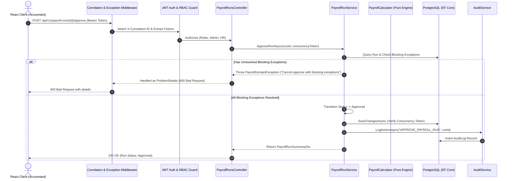

# PayFlow HR — Enterprise Architecture Specification

## 1. System Overview

**PayFlow HR** is an auditable, multi-tier Human Resources & Payroll Platform built on modern cloud-native standards. It is architected using **Clean Architecture** (Ports & Adapters) principles, ensuring strict domain decoupling, pure deterministic business logic, and defense-in-depth security.

```
+---------------------------------------------------------------------------------------------------------+
|                                        PAYFLOW HR SYSTEM TOPOLOGY                                       |
|                                                                                                         |
|  +---------------------------------------------------------------------------------------------------+  |
|  |                                  FRONTEND CLIENT (React 19 + TypeScript)                         |  |
|  |   - Tailwind CSS v4             - TanStack Query v5             - React Router v7                 |  |
|  |   - 1-Click Persona Switcher    - Interactive State Machine      - Live Exception Resolution Modal |  |
|  +---------------------------------------------------------------------------------------------------+  |
|                                                      | HTTP / REST (JSON + ProblemDetails)               |
|                                                      v                                                  |
|  +---------------------------------------------------------------------------------------------------+  |
|  |                                   PRESENTATION LAYER (PayFlow.Api)                                |  |
|  |   - Correlation ID Middleware    - RFC 7807 Global Error Handler - JWT & Cookie Dual Auth         |  |
|  |   - 5-Role RBAC Authorization    - Swagger / OpenAPI 3.0 Docs    - Serilog Structured Logging     |  |
|  +---------------------------------------------------------------------------------------------------+  |
|                                                      | Interfaces / DTOs                                 |
|                                                      v                                                  |
|  +---------------------------------------------------------------------------------------------------+  |
|  |                               APPLICATION LAYER (PayFlow.Application)                             |  |
|  |   - Pure Payroll Calculator     - Tax Engine Ruleset (2026)      - Proration & Overtime Logic     |  |
|  |   - Exception Detector Engine    - SHA-256 Snapshot Hasher       - Service Contracts & Models     |  |
|  +---------------------------------------------------------------------------------------------------+  |
|                                                      | Entities / Aggregates                             |
|                                                      v                                                  |
|  +---------------------------------------------------------------------------------------------------+  |
|  |                                  DOMAIN LAYER (PayFlow.Domain)                                    |  |
|  |   - Employee / Compensation      - PayrollRun Aggregate Root     - Value Objects & Precision      |  |
|  |   - State Machine Enums          - AuditLog Entities             - Pure Business Rules            |  |
|  +---------------------------------------------------------------------------------------------------+  |
|                                                      ^ Implementation                                   |
|                                                      |                                                  |
|  +---------------------------------------------------------------------------------------------------+  |
|  |                              INFRASTRUCTURE LAYER (PayFlow.Infrastructure)                        |  |
|  |   - PayFlowDbContext (EF Core)   - PostgreSQL Provider (Npgsql)  - PBKDF2 Password Hasher         |  |
|  |   - Complete 25-Emp Data Seeder  - Auditing Interceptors         - ACID Transaction Lifecycle     |  |
|  +---------------------------------------------------------------------------------------------------+  |
|                                                      | Database Driver                                   |
|                                                      v                                                  |
|  +---------------------------------------------------------------------------------------------------+  |
|  |                                   PERSISTENCE (PostgreSQL 16)                                     |  |
|  |   - Port 5434 (Collision-Free)   - numeric(18, 4) Precision      - Optimistic Concurrency Tokens  |  |
|  +---------------------------------------------------------------------------------------------------+  |
+---------------------------------------------------------------------------------------------------------+
```

---

## 2. Layer Responsibilities & Boundaries

### 2.1 Domain Layer (`PayFlow.Domain`)
The core of the enterprise model containing business entities, domain exceptions, and enums:
- **No external framework dependencies** (no ASP.NET, no EF Core).
- Aggregates:
  - [`PayrollRun`](file:///d:/Enterprise%20Payroll%20&%20HR%20Platform/src/PayFlow.Domain/Entities/PayrollRun.cs): Aggregate root controlling the lifecycle (`Draft` $\rightarrow$ `Calculating` $\rightarrow$ `Calculated` $\rightarrow$ `InReview` $\rightarrow$ `Approved` $\rightarrow$ `Paid`).
  - [`PayrollItem`](file:///d:/Enterprise%20Payroll%20&%20HR%20Platform/src/PayFlow.Domain/Entities/PayrollItem.cs): Detailed payroll line item per employee, including gross, net, taxes, deductions, and child components.
  - [`EmployeeCompensation`](file:///d:/Enterprise%20Payroll%20&%20HR%20Platform/src/PayFlow.Domain/Entities/EmployeeCompensation.cs): Versioned compensation contract history. Past records are immutable.
  - [`PayrollException`](file:///d:/Enterprise%20Payroll%20&%20HR%20Platform/src/PayFlow.Domain/Entities/PayrollException.cs): Automated calculation anomalies categorized by severity (`Blocking` vs `Warning`).
  - [`AuditLog`](file:///d:/Enterprise%20Payroll%20&%20HR%20Platform/src/PayFlow.Domain/Entities/AuditLog.cs): Tamper-evident ledger capturing who, what, when, before/after JSON, and correlation IDs.

### 2.2 Application Layer (`PayFlow.Application`)
Orchestrates business workflows and houses pure mathematical calculation engines:
- **Pure Payroll Calculator**: Isolated from database dependencies. Can be tested independently in microseconds with zero mocks.
- **Exception Rule Engine**: Scans calculated outputs and validates preconditions (e.g. valid bank routing, non-negative net, realistic overtime).
- **Snapshot Hashing Service**: Serializes run items into a normalized payload and generates a SHA-256 cryptographic digest.

### 2.3 Infrastructure Layer (`PayFlow.Infrastructure`)
Adapters for persistence, security, and external services:
- **`PayFlowDbContext`**: Configured with EF Core 10 for PostgreSQL. Enforces `numeric(18, 4)` across all monetary fields and strict foreign key cascade rules.
- **`PayrollRunService`**: Manages state transitions, database transactions, concurrency tokens, and exception resolution.
- **`PasswordHasher`**: Uses RFC 2898 PBKDF2 HMAC-SHA256 with 100,000 iterations and cryptographic salts.
- **`DataSeeder`**: Automatically seeds Northstar Technologies organization with 5 departments, 15 designations, 25 realistic employees, 5 persona users, historical Paid February 2026 run, and active March 2026 run with fixable exceptions.

### 2.4 Presentation Layer (`PayFlow.Api`)
ASP.NET Core 10 RESTful API:
- **Correlation ID Tracking**: Generates or forwards `X-Correlation-ID` header across every request and response.
- **RFC 7807 ProblemDetails**: Standardized error envelopes with error codes, detailed messages, and HTTP status codes.
- **JWT & Cookie Authentication**: Supports both `Authorization: Bearer <token>` and `payflow_jwt` HttpOnly cookie.
- **Role-Based Access Control**: 5 authorization policies (`Admin`, `HR`, `Manager`, `Accountant`, `Employee`).
- **OpenAPI / Swagger 3.0**: Interactive documentation and schema discovery.

---

## 3. Request Execution Flow



---

## 4. Concurrency Control & State Protection

PayFlow HR implements **Optimistic Concurrency Control** across all state-altering operations:
1. Every `PayrollRun` entity includes a `ConcurrencyToken` GUID.
2. Whenever a run is updated or changes state, a new `Guid.NewGuid()` is generated.
3. State mutation endpoints (`/submit-review`, `/approve`, `/mark-paid`) require the client to supply the current `ConcurrencyToken`.
4. If a concurrent modification occurred in the interim, the operation is rejected with HTTP 409 Conflict / 400 Bad Request, preventing double approvals or conflicting state mutations.
