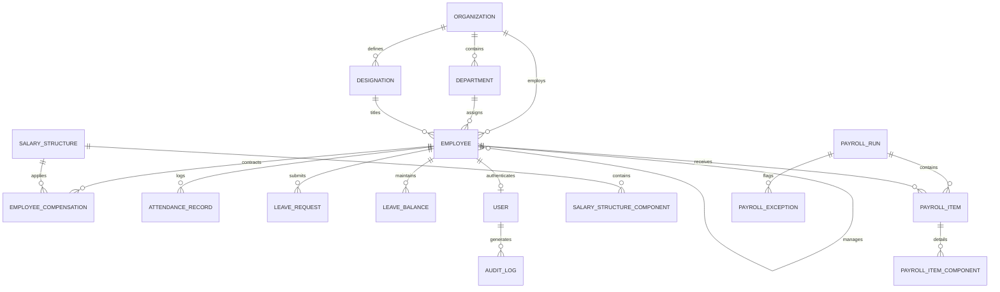

# PayFlow HR — Database & Data Model Specification

## 1. Entity-Relationship Overview

The **PayFlow HR** data model is normalized to Third Normal Form (3NF) while maintaining immutable historical snapshots for compensation contracts, calculation line items, and audit records.

---

## 2. Core Entities & Schema Reference

### 2.1 Organizations & Hierarchy

#### `Organizations`
Represents the top-level operating entity ("Northstar Technologies Inc.").
| Column | Type | Nullable | Description |
| :--- | :--- | :--- | :--- |
| `Id` | `uuid` | No | Primary Key |
| `Name` | `varchar(150)` | No | Organization display name |
| `LegalName` | `text` | No | Legal registered corporate entity name |
| `TaxIdentifier` | `text` | No | Corporate tax registration ID |
| `Timezone` | `text` | No | Default operating timezone (`America/New_York`) |
| `PayrollFrequency`| `int` | No | Enum: `Monthly` (0), `BiWeekly` (1), `SemiMonthly` (2) |
| `Currency` | `varchar(10)` | No | Base currency code (`USD`) |
| `WorkingDaysPerWeek`| `int` | No | Standard working days per week (5) |
| `StandardHoursPerDay`| `numeric(18,2)`| No | Standard daily working hours (8.00) |

#### `Departments`
| Column | Type | Nullable | Description |
| :--- | :--- | :--- | :--- |
| `Id` | `uuid` | No | Primary Key |
| `Name` | `varchar(100)` | No | Department name (e.g. Engineering, Finance) |
| `Code` | `varchar(20)` | No | Unique department code (`ENG`, `FIN`, etc.) |
| `ManagerEmployeeId` | `uuid` | Yes | Foreign Key referencing [`Employees.Id`](file:///d:/Enterprise%20Payroll%20&%20HR%20Platform/src/PayFlow.Domain/Entities/Employee.cs) |
| `IsActive` | `boolean` | No | Soft-status flag |

#### `Designations`
| Column | Type | Nullable | Description |
| :--- | :--- | :--- | :--- |
| `Id` | `uuid` | No | Primary Key |
| `Title` | `varchar(100)` | No | Job title (e.g., Senior Software Engineer) |
| `Code` | `varchar(20)` | No | Unique code (`SR-DEV`, `CFO`, etc.) |
| `Level` | `int` | No | Corporate job grade level (1-10) |

---

### 2.2 Employee Master & Compensation History

#### `Employees`
| Column | Type | Nullable | Description |
| :--- | :--- | :--- | :--- |
| `Id` | `uuid` | No | Primary Key |
| `EmployeeNo` | `varchar(30)` | No | Unique employee code (`EMP-ENG-001`) |
| `FirstName` | `varchar(50)` | No | Employee legal first name |
| `LastName` | `varchar(50)` | No | Employee legal last name |
| `WorkEmail` | `varchar(150)` | No | Unique enterprise email address |
| `DepartmentId` | `uuid` | No | Foreign Key to `Departments` |
| `DesignationId` | `uuid` | No | Foreign Key to `Designations` |
| `ReportsToEmployeeId`| `uuid`| Yes | Self-referencing FK for organizational chart |
| `JoinDate` | `timestamp` | No | Date employment commenced |
| `TerminationDate`| `timestamp`| Yes | Exit date (if employment ended) |
| `Status` | `int` | No | Enum: `Active`, `OnLeave`, `Probation`, `Terminated` |
| `PaymentMethod` | `int` | No | Enum: `BankTransfer`, `Check`, `Cash` |
| `BankName` | `varchar(100)` | Yes | Commercial banking partner |
| `BankAccountNumber`| `varchar(50)` | Yes | Encrypted/masked account number |
| `BankRoutingNumber`| `varchar(50)` | Yes | Bank ABA/SWIFT routing code |

#### `EmployeeCompensations` (Versioned History)
> [!IMPORTANT]
> **Historical Integrity**: A compensation record is never overwritten when an employee receives a salary increase or promotion. Instead, the current record's `EffectiveTo` date is set, and a new record with `EffectiveFrom` is inserted. Past payroll runs always bind to the exact historical contract valid for that period.

| Column | Type | Nullable | Description |
| :--- | :--- | :--- | :--- |
| `Id` | `uuid` | No | Primary Key |
| `EmployeeId` | `uuid` | No | Foreign Key to `Employees` |
| `SalaryStructureId` | `uuid` | Yes | Foreign Key to `SalaryStructures` |
| `BaseSalary` | `numeric(18,4)`| No | Monthly base salary rate |
| `EffectiveFrom` | `timestamp` | No | Starting date of this compensation contract |
| `EffectiveTo` | `timestamp` | Yes | Expiration date of this contract |
| `Currency` | `varchar(10)` | No | Currency code (`USD`) |
| `IsActive` | `boolean` | No | Whether this is the active current contract |

---

### 2.3 Payroll Execution Aggregates

#### `PayrollRuns` (Aggregate Root)
| Column | Type | Nullable | Description |
| :--- | :--- | :--- | :--- |
| `Id` | `uuid` | No | Primary Key |
| `PeriodYear` | `int` | No | Payroll calendar year (e.g. 2026) |
| `PeriodMonth` | `int` | No | Payroll calendar month (1-12) |
| `PeriodStart` | `date` | No | Date cycle begins (e.g., 2026-03-01) |
| `PeriodEnd` | `date` | No | Date cycle ends (e.g., 2026-03-31) |
| `Status` | `int` | No | State Machine: `Draft`, `Calculating`, `Calculated`, `InReview`, `Approved`, `Paid` |
| `TotalGross` | `numeric(18,4)`| No | Sum of gross compensation across all line items |
| `TotalNet` | `numeric(18,4)`| No | Sum of net take-home pay disbursed |
| `TotalTaxWithheld` | `numeric(18,4)`| No | Total income tax withheld for authorities |
| `TotalDeductions` | `numeric(18,4)`| No | Total voluntary and benefit deductions |
| `TotalEmployerCost`| `numeric(18,4)`| No | Total Cost to Company including benefits |
| `CalculationHash` | `varchar(128)` | Yes | SHA-256 tamper-evident calculation digest |
| `ConcurrencyToken` | `uuid` | No | Optimistic concurrency verification token |
| `ApprovedByUserId` | `uuid` | Yes | User ID of approving authority |
| `ApprovedAtUtc` | `timestamp` | Yes | Timestamp of approval signoff |
| `PaymentReference` | `varchar(100)` | Yes | ACH/Fedwire reference (e.g. `ACH-20260331-NT`) |
| `PaidAtUtc` | `timestamp` | Yes | Timestamp funds were disbursed |

#### `PayrollItems`
Detailed calculation snapshot for a single employee in a given run:
| Column | Type | Nullable | Description |
| :--- | :--- | :--- | :--- |
| `Id` | `uuid` | No | Primary Key |
| `PayrollRunId` | `uuid` | No | Foreign Key to `PayrollRuns` |
| `EmployeeId` | `uuid` | No | Foreign Key to `Employees` |
| `BaseSalary` | `numeric(18,4)`| No | Base salary rate applied |
| `ProratedBaseSalary`| `numeric(18,4)`| No | Prorated base for mid-month joins/exits |
| `AllowancesTotal` | `numeric(18,4)`| No | Sum of all allowance components |
| `OvertimePay` | `numeric(18,4)`| No | Overtime compensation earned |
| `OvertimeHours` | `numeric(18,2)`| No | Overtime hours recorded |
| `UnpaidLeaveDeduction`| `numeric(18,4)`| No | Loss of pay for unpaid time off |
| `GrossPay` | `numeric(18,4)`| No | Total taxable and non-taxable gross |
| `TaxWithholding` | `numeric(18,4)`| No | Progressive tax withheld |
| `PensionDeduction` | `numeric(18,4)`| No | Employee retirement / 401(k) deduction |
| `HealthContribution`| `numeric(18,4)`| No | Employee health premium deduction |
| `TotalDeductions` | `numeric(18,4)`| No | Total employee deductions |
| `NetPay` | `numeric(18,4)`| No | Final take-home disbursement |
| `EmployerPensionMatch`| `numeric(18,4)`| No | Employer matching contribution |
| `EmployerHealthContribution`| `numeric(18,4)`| No | Employer health contribution |
| `TotalCostToCompany`| `numeric(18,4)`| No | CTC for this employee |

#### `PayrollExceptions`
Flagged anomalies discovered during payroll calculation:
| Column | Type | Nullable | Description |
| :--- | :--- | :--- | :--- |
| `Id` | `uuid` | No | Primary Key |
| `PayrollRunId` | `uuid` | No | Foreign Key to `PayrollRuns` |
| `PayrollItemId`| `uuid` | Yes | Foreign Key to `PayrollItems` |
| `EmployeeId` | `uuid` | No | Foreign Key to `Employees` |
| `Code` | `varchar(50)` | No | Exception code (`MISSING_BANK_ACCOUNT`, etc.) |
| `Severity` | `int` | No | Enum: `Warning` (0), `Blocking` (1) |
| `Message` | `text` | No | Plain-text explanation of the issue |
| `IsResolved` | `boolean` | No | Whether the issue has been cleared |
| `ResolvedByUserId`| `uuid`| Yes | User ID of the resolving officer |
| `ResolutionNotes`| `text`| Yes | Mandatory justification for resolving |
| `ResolvedAtUtc`| `timestamp`| Yes | Timestamp issue was cleared |

---

### 2.4 Authentication & Auditing

#### `Users`
| Column | Type | Nullable | Description |
| :--- | :--- | :--- | :--- |
| `Id` | `uuid` | No | Primary Key |
| `UserName` | `varchar(50)` | No | Unique login username |
| `Email` | `varchar(150)` | No | Unique enterprise email |
| `PasswordHash` | `text` | No | PBKDF2 HMAC-SHA256 salted hash |
| `Role` | `int` | No | Enum: `Admin` (0), `HR` (1), `Manager` (2), `Accountant` (3), `Employee` (4) |
| `EmployeeId` | `uuid` | Yes | Foreign Key to `Employees` (links persona to HR record) |
| `IsActive` | `boolean` | No | Account status |

#### `AuditLogs`
Immutable append-only security ledger:
| Column | Type | Nullable | Description |
| :--- | :--- | :--- | :--- |
| `Id` | `uuid` | No | Primary Key |
| `ActorId` | `uuid` | Yes | ID of user executing the action |
| `ActorEmail` | `text` | No | Email of the acting user |
| `ActorRole` | `text` | No | Security role of the acting user |
| `Action` | `varchar(100)` | No | Event type (`APPROVE_PAYROLL_RUN`, `LOGIN_SUCCESS`, etc.) |
| `EntityType` | `varchar(100)` | No | Entity modified (`PayrollRun`, `EmployeeCompensation`) |
| `EntityId` | `text` | Yes | ID of modified entity |
| `CorrelationId`| `text` | Yes | Request correlation ID for end-to-end tracing |
| `TimestampUtc` | `timestamp` | No | Exact event timestamp in UTC |
| `Summary` | `text` | No | Human-readable explanation of the change |
| `BeforeValuesJson`| `text` | Yes | Serialized JSON snapshot before mutation |
| `AfterValuesJson` | `text` | Yes | Serialized JSON snapshot after mutation |
