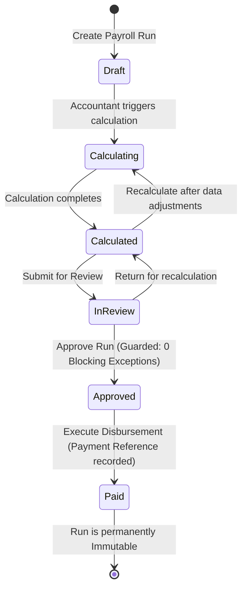

# PayFlow HR — Deterministic Payroll Engine Specification

## 1. Overview & Engine Philosophy

The **PayFlow HR** Payroll Calculation Engine is a pure, deterministic, and auditable financial processing system. It translates organizational employee master data, historical compensation contracts, timesheets, and leave records into exact, verifiable payroll disbursements.

```
+----------------------------------------------------------------------------------------------------+
|                                    DETERMINISTIC ENGINE CORE                                       |
|                                                                                                    |
|  [ Employee Base Data ]  \                                       /  [ Net Pay Disbursement ]       |
|  [ Compensation Plan  ]  ---\                               /---    [ Tax Withholding Breakdown ]   |
|  [ Attendance Hours   ]  ---> [ PURE REPRODUCIBLE ENGINE ] --->     [ Employer CTC & Contributions] |
|  [ Approved Leaves    ]  ---/                               \---    [ Tamper-Evident SHA-256 Hash ] |
|  [ Demo Tax Brackets  ]  /                                       \  [ Exceptions & Warnings ]       |
+----------------------------------------------------------------------------------------------------+
```

### Core Design Principles
1. **Deterministic & Idempotent**: Given the exact same inputs (employee compensation, attendance, leaves), the engine produces the exact same numerical outputs to 4 decimal places, rounded to 2 decimal places for financial recording.
2. **Fixed-Point Financial Arithmetic**: The system strictly employs `System.Decimal` in .NET and `numeric(18, 4)` in PostgreSQL. Binary floating-point arithmetic (`double`, `float`) is strictly prohibited to eliminate rounding drift.
3. **Midpoint Rounding (AwayFromZero)**: All intermediate and final currency calculations utilize `MidpointRounding.AwayFromZero` (commercial standard rounding: 0.5 rounds away from zero).
4. **Historical Compensation Integrity**: Calculations never reference volatile employee profiles directly; they reference the active, dated [`EmployeeCompensation`](file:///d:/Enterprise%20Payroll%20&%20HR%20Platform/src/PayFlow.Domain/Entities/EmployeeCompensation.cs) snapshot valid for the payroll run's date range. Past payroll records remain unaltered even if compensation changes later.
5. **Zero-Blocking Exception Approval Gate**: A payroll run cannot transition to `Approved` status if a single blocking exception remains unresolved.
6. **Tamper-Evident Calculation Snapshots**: Calculated runs compute an aggregate SHA-256 cryptographic digest across all gross, net, deduction, and tax items.

---

## 2. Mathematical Calculations & Formulas

### 2.1 Working Days & Standard Hours
- **Working Days in Month ($W_m$)**: Number of non-weekend, non-holiday calendar days in the pay period.
- **Standard Working Hours ($H_s$)**: Typically 160 to 176 hours per month ($W_m \times 8$).

### 2.2 Base Salary & Proration
If an employee joined after the 1st of the month or terminated before the end of the month:
$$\text{Active Days} = \min(\text{EndDate}, \text{PeriodEnd}) - \max(\text{StartDate}, \text{PeriodStart}) + 1$$
$$\text{Proration Factor} = \frac{\text{Active Working Days}}{\text{Total Month Working Days}}$$
$$\text{Base Salary}_{\text{prorated}} = \text{Base Salary}_{\text{monthly}} \times \text{Proration Factor}$$

### 2.3 Unpaid Leave Deduction (Loss of Pay - LOP)
$$\text{Daily Rate} = \frac{\text{Base Salary}_{\text{monthly}}}{W_m}$$
$$\text{Unpaid Leave Deduction} = \text{Unpaid Days} \times \text{Daily Rate}$$

### 2.4 Overtime Compensation
$$\text{Hourly Rate} = \frac{\text{Base Salary}_{\text{monthly}}}{H_s}$$
$$\text{Overtime Pay} = \text{Overtime Hours} \times (\text{Hourly Rate} \times 1.5)$$

### 2.5 Allowances & Gross Pay
Allowances include Housing Allowance, Transport Allowance, Medical Allowance, and Special Performance Allowances.
$$\text{Gross Pay} = \text{Base Salary}_{\text{prorated}} + \sum \text{Allowances} + \text{Overtime Pay} - \text{Unpaid Leave Deduction}$$

### 2.6 Progressive Tax Engine (`DEMO-PROGRESSIVE-2026`)

> [!WARNING]
> **Statutory Disclaimer**: The tax brackets utilized in PayFlow HR are demo-configured rules (`DEMO-PROGRESSIVE-2026`) designed to showcase tiered progressive bracket computations. They do **not** represent authoritative local statutory advice for Bangladesh, the United States, or any other specific jurisdiction.

The taxable gross is assessed against annualized demo brackets:
$$\text{Annual Taxable Income} = \text{Taxable Monthly Gross} \times 12$$

| Annual Income Tier | Marginal Tax Rate |
| :--- | :--- |
| Up to \$30,000 | 0.0% (Zero bracket allowance) |
| \$30,001 to \$60,000 | 10.0% |
| \$60,001 to \$100,000 | 15.0% |
| \$100,001 to \$150,000 | 20.0% |
| Above \$150,000 | 25.0% |

$$\text{Monthly Tax Withholding} = \frac{\text{Annual Calculated Tax}}{12}$$

### 2.7 Mandatory & Voluntary Deductions
- **Employee Pension / 401(k) / Provident Fund**: Standard 5.0% of base salary.
- **Employee Health Benefit Contribution**: Standard fixed rate (\$80.00 - \$120.00 / month depending on tier).
- **Total Deductions**:
$$\text{Total Deductions} = \text{Tax Withholding} + \text{Pension Deduction} + \text{Health Contribution}$$

### 2.8 Net Take-Home Pay
$$\text{Net Pay} = \text{Gross Pay} - \text{Total Deductions}$$

### 2.9 Employer Contributions & Total Cost to Company (CTC)
- **Employer Pension Match**: Standard 5.0% of base salary.
- **Employer Health Contribution**: Standard \$200.00 / month.
$$\text{Total Cost to Company (CTC)} = \text{Gross Pay} + \sum \text{Employer Contributions}$$

---

## 3. Payroll Run State Machine



### State Guard Rules
1. **Draft $\rightarrow$ Calculating**:
   - Authorized roles: `Admin`, `Accountant`.
   - Populates eligible employees based on active employment dates.
2. **Calculating $\rightarrow$ Calculated**:
   - Executes deterministic formulas for each employee.
   - Evaluates automated exception rules (missing bank info, extreme overtime, negative net).
   - Generates SHA-256 calculation hash.
3. **Calculated $\rightarrow$ InReview**:
   - Authorized roles: `Admin`, `Accountant`.
   - Confirms preliminary numbers are ready for managerial / HR signoff.
4. **InReview $\rightarrow$ Approved**:
   - Authorized roles: `Admin`, `HR`.
   - **STRICT GATE**: `BlockingExceptionsCount == 0`.
   - If any blocking exception is unresolved, the API rejects with HTTP 400 Bad Request.
   - Records `ApprovedByUserId` and `ApprovedAtUtc`.
5. **Approved $\rightarrow$ Paid**:
   - Authorized roles: `Admin`, `Accountant`.
   - Requires non-empty payment reference (e.g., `FEDWIRE-ACH-2026-03-31`).
   - Marks all line items as finalized.
6. **Paid (Terminal State)**:
   - Permanently locked. Any subsequent `POST /calculate` or modification returns HTTP 400.

---

## 4. Automated Exception Engine

During each calculation run, the engine scans all employee items for data anomalies:

| Exception Code | Severity | Description | Resolution Path |
| :--- | :--- | :--- | :--- |
| `MISSING_BANK_ACCOUNT` | **Blocking** | Employee does not have a valid bank account number configured. | HR adds bank details or Accountant overrides with manual check voucher note. |
| `NEGATIVE_NET_PAY` | **Blocking** | Total deductions exceed gross pay. | HR/Accountant adjusts voluntary deductions or applies advance loan relief. |
| `ZERO_HOURLY_RATE` | **Blocking** | Overtime hours logged but hourly compensation is zero. | HR updates compensation structure. |
| `HIGH_OVERTIME_VARIANCE` | **Warning** | Employee logged $> 20$ hours of overtime in a single period. | Informational; reviewer acknowledges justification. |
| `RETROACTIVE_ADJUSTMENT`| **Warning** | Attendance correction was applied after the month cut-off. | Informational; reviewer verifies biometric supervisor signoff. |

---

## 5. Tamper-Evident SHA-256 Calculation Hash

To ensure end-to-end auditability and detect unauthorized database alterations, every calculated run generates a cryptographic digest:

```csharp
public string ComputeSnapshotHash(PayrollRun run, IEnumerable<PayrollItem> items)
{
    var orderedItems = items
        .OrderBy(i => i.EmployeeId)
        .Select(i => $"{i.EmployeeId}:{i.GrossPay:F2}:{i.NetPay:F2}:{i.TaxWithholding:F2}:{i.TotalDeductions:F2}");

    var payload = $"{run.Id}:{run.PeriodStart:O}:{run.PeriodEnd:O}:{run.TotalGross:F2}:{run.TotalNet:F2}|" 
        + string.Join(";", orderedItems);

    using var sha256 = SHA256.Create();
    var hashBytes = sha256.ComputeHash(Encoding.UTF8.GetBytes(payload));
    return Convert.ToHexString(hashBytes).ToLowerInvariant();
}
```

The resulting hash (e.g. `e3b0c44298fc1c149afbf4c8996fb92427ae41e4649b934ca495991b7852b855`) is stored in `PayrollRun.CalculationHash`. During compliance reviews, auditors can recalculate the hash against the individual line items to confirm mathematical fidelity.
