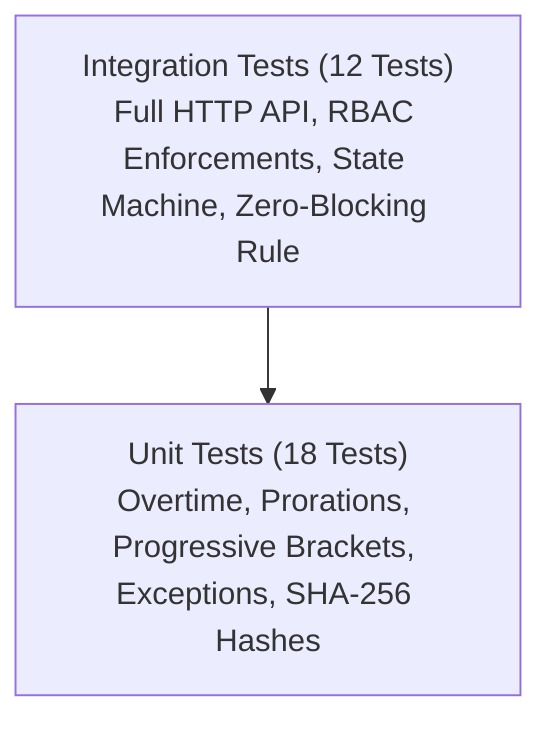

# PayFlow HR — Enterprise Portfolio & Technical Showcase

## 1. Executive Summary

**PayFlow HR** is an auditable, secure Human Resources & Payroll platform engineered to demonstrate high-assurance software design. Built on **.NET 10 LTS**, **ASP.NET Core Web API**, **Entity Framework Core 10**, **PostgreSQL 16**, **React 19**, **TypeScript**, and **Tailwind CSS v4**, the application models enterprise financial operations where precision, compliance, tamper-evidence, and strict authorization are mandatory.

Designed around the fictional enterprise **Northstar Technologies Inc.** (25 employees, 5 departments), PayFlow HR features a deterministic calculation engine, a 6-stage lifecycle state machine, immutable historical audit logs, and server-enforced security boundaries.

```
+-----------------------------------------------------------------------------------------------------+
|                                          PORTFOLIO SCORECARD                                        |
|                                                                                                     |
|  [ Architecture ] Clean Architecture / DDD    |  [ Frameworks   ] .NET 10 LTS & React 19            |
|  [ Tests Total  ] 30 Tests (100% Pass Rate)   |  [ Test Types   ] 18 Unit & 12 Integration Tests    |
|  [ Arithmetic   ] 100% Decimal Precision      |  [ Cryptography ] SHA-256 Digest & PBKDF2 (100k)   |
|  [ Auditability ] Tamper-Evident Snapshots     |  [ Security     ] 5-Role Server-Side RBAC           |
|  [ Deployment   ] Docker Compose & GitHub CI  |  [ Database     ] PostgreSQL 16 (numeric 18,4)      |
+-----------------------------------------------------------------------------------------------------+
```

---

## 2. Key Engineering Highlights

### 2.1 Pure Deterministic Payroll Engine
- **Zero Floating-Point Drift**: All currency computations strictly use `.NET` `decimal` and database `numeric(18, 4)`. Floating-point types (`float`, `double`) are banned from financial paths.
- **Commercial Rounding (`MidpointRounding.AwayFromZero`)**: Eliminates rounding bias by consistently rounding 0.5 away from zero across all intermediate calculations and payslip line items.
- **Pure Functional Core**: The calculation engine ([`PayrollCalculatorServices.cs`](file:///d:/Enterprise%20Payroll%20&%20HR%20Platform/src/PayFlow.Application/Payroll/Services/PayrollCalculatorServices.cs)) is a pure function that requires no database connections, no mocks, and executes in microseconds, allowing exhaustive unit testing across edge cases.

### 2.2 Tamper-Evident SHA-256 Calculation Snapshots
Every calculated payroll run computes a deterministic SHA-256 cryptographic digest over the ordered line items (employee ID, gross pay, net pay, tax withholdings, and total deductions).
- Any out-of-band manipulation of database values immediately invalidates the hash.
- Provides cryptographic proof of data integrity for internal audit committees and external compliance regulators.

### 2.3 Zero-Blocking Exception Approval Gate
Payroll runs cannot transition to `Approved` or `Paid` if a single blocking exception is open.
- The seeded March 2026 payroll run includes a realistic blocking exception: **James Liu** has a `MISSING_BANK_ACCOUNT` flag.
- The state machine blocks approval attempts with `400 Bad Request` until the accountant or HR resolves the exception with an auditable justification note.

### 2.4 Historical Compensation Immutability
Traditional HR systems often overwrite base salaries during promotions, corrupting historical recalculations. PayFlow HR implements dated compensation contracts (`EmployeeCompensation` with `EffectiveFrom` and `EffectiveTo`). Past payroll periods always bind to the active contract for that specific historical window.

### 2.5 Defense-in-Depth Security & Role Isolation
Server-side authorization strictly segregates capabilities across 5 personas:
- **Admin**: System governance, configuration, audit trail.
- **HR**: Employee lifecycle, compensation structures, leave management.
- **Manager**: Department team view, team leave approvals. Prohibited from viewing employee salaries outside their reporting line.
- **Accountant**: Payroll execution, calculation triggers, exception resolution, disbursements.
- **Employee**: Personal self-service portal, own attendance and payslips. **Enforces HTTP 403 Forbidden** if an employee attempts to inspect any other employee's payslip or salary.

---

## 3. Automated Test Pyramid

The platform is fortified by a comprehensive 30-test automated test suite achieving a **100% pass rate** on `.NET 10`:



### 3.1 Unit Test Suite (18 Tests)
- `Calculate_StandardFullMonth_ReturnsAccurateGrossAndNet`: Verifies standard baseline salary calculation.
- `Calculate_WithMidMonthJoin_AppliesExactProration`: Validates proration factor for employees joining mid-cycle.
- `Calculate_WithUnpaidLeave_DeductsExactLossOfPay`: Verifies daily rate deduction for unpaid time off.
- `Calculate_WithOvertime_Calculates1Point5xRate`: Validates 1.5x hourly multiplier.
- `Calculate_ProgressiveTax_AppliesTiersAccurately`: Tests progressive bracket tiering across income levels.
- `Calculate_RoundingPrecision_MaintainsAwayFromZero`: Confirms commercial rounding precision.
- `ValidateExceptions_MissingBankAccount_ProducesBlockingException`: Confirms exception rule engine behavior.
- `ComputeSnapshotHash_WithIdenticalInputs_ProducesIdenticalSha256`: Proves deterministic hashing idempotency.

### 3.2 Integration Test Suite (12 Tests)
- `Login_WithInvalidCredentials_ReturnsUnauthorized`: Security boundary validation.
- `Login_WithValidPersonas_SucceedsWithCorrectRole` (5 Theory cases): Verifies all 5 persona credentials (`admin`, `hr`, `manager`, `accountant`, `employee`).
- `RBAC_EmployeeCannotAccessPayrollRuns_ReturnsForbidden`: Enforces non-privileged access blocking.
- `RBAC_ManagerCannotApprovePayrollRuns_ReturnsForbidden`: Enforces managerial separation of duties.
- `RBAC_EmployeeCannotAccessOtherEmployeePayslip_ReturnsForbidden`: Verifies payslip isolation (HTTP 403).
- `RBAC_EmployeeCanAccessOwnPayslip_ReturnsSuccess`: Verifies legitimate self-service access.
- `PayrollLifecycle_AccountantRunsCalculationsAndEnforcesApprovalZeroBlockingRule`: End-to-end full lifecycle test validating the entire sequence: Recalculate $\rightarrow$ Approval Rejected with 400 $\rightarrow$ Resolve Exception $\rightarrow$ Submit Review $\rightarrow$ Approve $\rightarrow$ Mark Paid $\rightarrow$ Immutability Check $\rightarrow$ CSV Export.
- `AuditLog_LogsActionsProperly`: Confirms security audit event capture.

---

## 4. Frontend Experience & Design System

The React 19 web application is built for enterprise productivity:
- **1-Click Persona Switcher**: Sticky navigation bar includes rapid 1-click persona switching (`Admin`, `HR`, `Manager`, `Accountant`, `Employee`) allowing immediate role transition demonstrations.
- **Interactive State Machine Stepper**: Visual step indicator illustrating current run status (`Draft` $\rightarrow$ `Calculating` $\rightarrow$ `Calculated` $\rightarrow$ `InReview` $\rightarrow$ `Approved` $\rightarrow$ `Paid`).
- **Live Exception Resolver Modal**: Interactive modal allowing accountants to inspect blocking exceptions and enter resolution notes directly into the workflow.
- **Self-Service Payslip View**: Printable payslip with breakdown of gross earnings, progressive tax, retirement contributions, and masked banking details.
- **Executive Analytics**: Recharts data visualizations showing monthly payroll trends, gross vs net expenditures, and departmental labor distributions.

---

## 5. Architectural Decision Records (ADRs)

| Decision | Context | Outcome |
| :--- | :--- | :--- |
| **ADR-001: Pure Calculator Service** | Payroll logic is historically prone to regressions when tied to database entities. | Separated mathematical logic into pure static-friendly calculator services, enabling sub-millisecond unit test coverage. |
| **ADR-002: Dual Token Delivery** | Web apps need XSS protection; mobile and CLI clients need header tokens. | Implemented both `Authorization: Bearer <token>` and `payflow_jwt` HttpOnly cookie. |
| **ADR-003: Relational Transaction Isolation** | EF Core In-Memory provider throws on `BeginTransactionAsync()`. | Implemented `_context.Database.IsRelational()` check, ensuring real PostgreSQL uses ACID transactions while tests remain fast and in-memory. |
| **ADR-004: Port Collision Mitigation** | Common dev ports (5432, 3000) are frequently occupied by existing containers. | Mapped PostgreSQL to host port `5434:5432`, API to `5005`, and Web to `5173`. |
